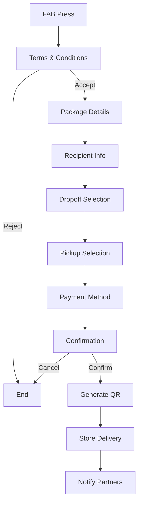
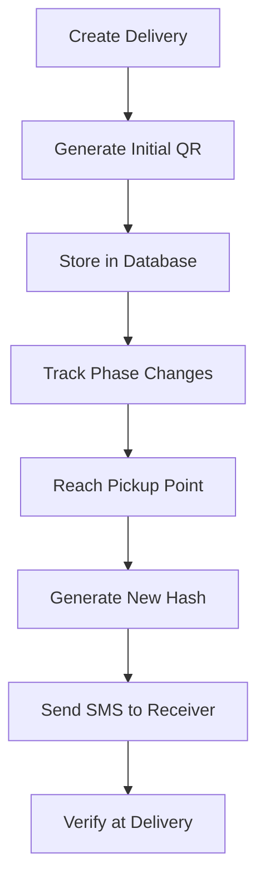
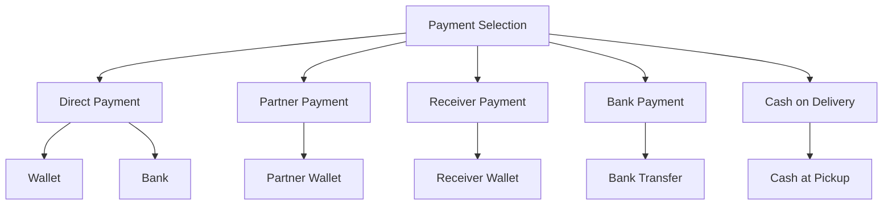
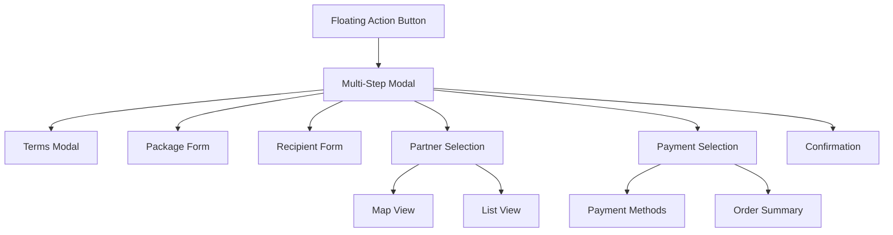
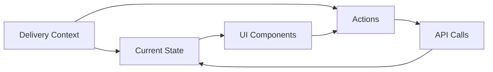
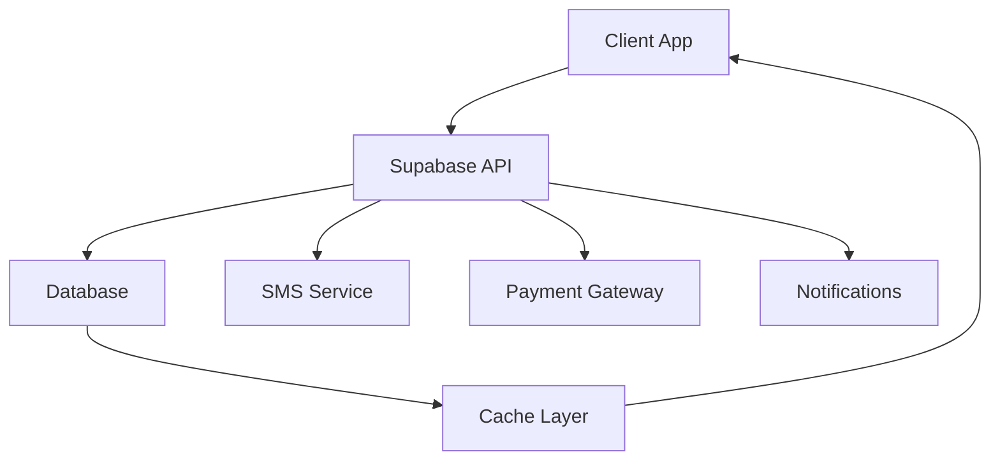
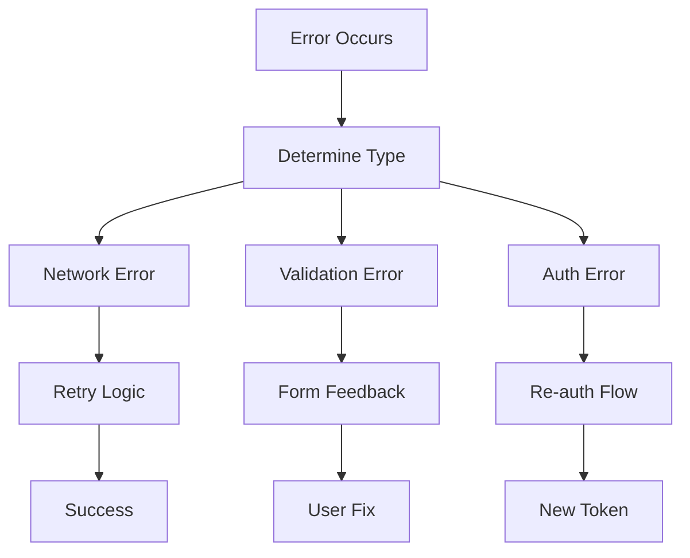

# System Patterns

## Architecture Overview

### Cross-Platform Architecture
- Shared business logic
- Platform-specific UI components
- Unified state management
- Common API layer
- Shared type definitions
- Platform detection utilities

### Mobile App Architecture
- Expo-based React Native
- Component-based architecture
- Navigation stack management
- State management with Zustand
- Custom hooks for shared logic
- Service layer for API communication

### Web App Architecture
- React with TypeScript
- Component-based architecture
- React Router for navigation
- State management with Zustand
- Custom hooks for shared logic
- Service layer for API communication

### Backend Architecture (Supabase)
- PostgreSQL database
- Row Level Security (RLS)
- Real-time subscriptions
- Edge Functions
- Storage buckets
- Authentication system

## Design Patterns

### Frontend Patterns
- Platform-specific components
- Shared business logic
- Custom hooks for platform detection
- Service layer pattern
- Repository pattern for data access
- Factory pattern for QR codes
- Strategy pattern for platform-specific features

### Backend Patterns
- Row Level Security policies
- Real-time subscription patterns
- Event-driven architecture
- Repository pattern
- Factory pattern for QR codes
- Strategy pattern for payment processing

### QR Code System
- **Structure Format**:
  ```
  QR_CODE = TRACKING_ID + PHASE_FLAG + TIMESTAMP + HASH
  Example: ADE20231001-2-1672531005-7c6d3a
  ```
- **Phase Flags**:
  - 0: Created
  - 1: At Dropoff Partner
  - 2: Courier Picked Up (to Hub)/in_transit_to_hub
  - 3: At Sorting Hub
  - 4: Courier Picked Up (to Recipient)/dispatched
  - 5: At Pickup Partner
  - 6: Delivered
- **Validation Logic**:
  - Partners/Couriers scan QR → Backend verifies phase progression
  - Each scan tied to timestamp, location, and user role
  - Phase transitions must follow valid sequence

## Component Structure

### Shared Components
- Authentication forms
- QR code scanner/generator
- Map components
- Chat interface
- Payment forms
- Loading states
- Error boundaries

### Mobile-Specific Components
- Native navigation
- Camera integration
- Push notifications
- Location services
- Biometric authentication

### Web-Specific Components
- Browser notifications
- File upload
- Progressive Web App
- Browser storage
- Service workers

## State Management

### Global State
- User authentication
- Language preferences
- Theme settings
- Navigation state
- Error handling
- Platform detection

### Local State
- Form state
- Parcel tracking
- Map state
- Chat state
- Payment state
- Platform-specific features

## Data Flow

### Frontend Data Flow
- Supabase queries
- Real-time subscriptions
- State updates
- Cache management
- Error handling
- Platform-specific data handling

### Backend Data Flow
- RLS policies
- Real-time events
- Database triggers
- Edge functions
- Storage operations
- Payment processing

## Security Patterns

### Authentication
- Supabase Auth
- JWT tokens
- Biometric authentication
- Session management
- Role-based access
- Platform-specific security

### Authorization
- Row Level Security
- Role-based permissions
- Resource protection
- API security
- Data encryption
- Platform-specific security

## Testing Strategy

### Frontend Testing
- Unit tests
- Integration tests
- E2E tests with Detox
- Performance tests
- Accessibility tests
- Cross-platform tests

### Backend Testing
- Database tests
- RLS policy tests
- Edge function tests
- Integration tests
- Security tests
- Payment integration tests

## Delivery Creation Flow



## QR Code Lifecycle



## Payment Flow Patterns



## Component Architecture



## State Management Pattern



## Data Flow



## Error Handling Pattern

