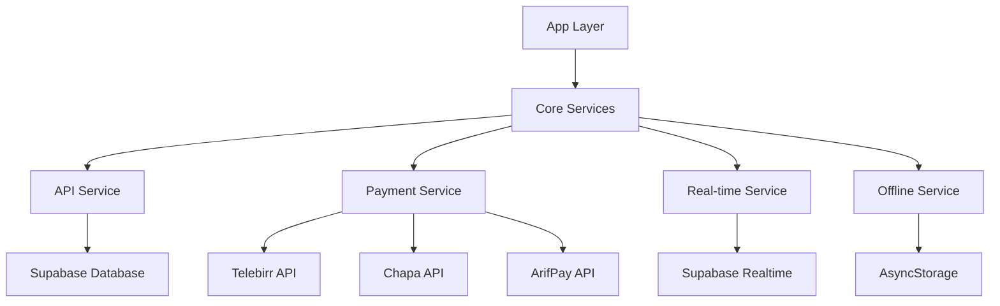

# 🚀 ADERA Core Services Layer

A comprehensive, production-ready services layer for the Adera app, providing robust business logic, payment processing, real-time features, and offline support.

## 📋 Overview

The Core Services Layer is the backbone of the Adera application, handling all critical business operations with proper error handling, offline support, and real-time capabilities. It's designed specifically for the Ethiopian market with local payment integrations and offline-first architecture.

## 🏗️ Architecture



## 🔧 Core Services

### 1. **API Service** (`ApiService.ts`)
**Purpose**: Core data operations and business logic

**Features**:
- ✅ Comprehensive CRUD operations for all entities
- ✅ Intelligent caching with offline support
- ✅ Robust error handling with typed errors
- ✅ Automatic retry mechanisms
- ✅ Data validation and sanitization

**Key Methods**:
```typescript
// User operations
await ApiService.getUserProfile(userId);
await ApiService.updateUserProfile(userId, updates);

// Wallet operations
await ApiService.getWalletBalance(userId);
await ApiService.updateWalletBalance(userId, newBalance);

// Parcel operations
await ApiService.createParcel(request, userId);
await ApiService.getParcelDetails(trackingId);
await ApiService.updateParcelStatus(request);

// Partner operations
await ApiService.getNearbyPartners(limit);

// E-commerce operations (Partner Role)
await ApiService.getShopByPartnerId(partnerId);
await ApiService.createShop(shopData);
await ApiService.updateShop(shopId, updates);

// Shop Categories
await ApiService.getShopCategories(shopId);
await ApiService.createShopCategory(categoryData);
await ApiService.updateShopCategory(categoryId, updates);
await ApiService.deleteShopCategory(categoryId);

// Shop Items (Inventory)
await ApiService.getShopItems(shopId, categoryId?);
await ApiService.getShopItem(itemId);
await ApiService.createShopItem(itemData);
await ApiService.updateShopItem(itemId, updates);
await ApiService.deleteShopItem(itemId);
await ApiService.updateItemStock(itemId, quantity);

// Shop Orders
await ApiService.getShopOrders(shopId, status?);
await ApiService.getShopOrder(orderId);
await ApiService.createShopOrder(orderData);
await ApiService.updateShopOrder(orderId, updates);
await ApiService.updateOrderStatus(orderId, status);

// Shop Transactions (Earnings)
await ApiService.getShopTransactions(shopId, limit);
await ApiService.createShopTransaction(transactionData);

// Shop Analytics
await ApiService.getShopAnalytics(shopId, period);

// Search and Discovery
await ApiService.searchShopItems(query, shopId?);
await ApiService.getFeaturedItems(shopId?, limit);
```

### 2. **Payment Service** (`PaymentService.ts`)
**Purpose**: Ethiopian payment gateway integrations

**Features**:
- ✅ Telebirr mobile money integration
- ✅ Chapa international payments
- ✅ ArifPay local payments
- ✅ Wallet and COD support
- ✅ Automatic commission calculations
- ✅ Transaction tracking and verification

**Supported Payment Methods**:
- 💳 **Telebirr** - Ethiopian mobile money
- 🌍 **Chapa** - International payments
- 💰 **ArifPay** - Local payment processing
- 🏦 **Wallet** - In-app wallet
- 💵 **Cash on Delivery** - Traditional payment

**Usage**:
```typescript
// Initialize payment gateways
PaymentService.initializeGateways({
  telebirr: { apiKey: '...', secretKey: '...', baseUrl: '...' },
  chapa: { apiKey: '...', secretKey: '...', baseUrl: '...' },
  arifpay: { apiKey: '...', secretKey: '...', baseUrl: '...' }
});

// Process payment
const response = await PaymentService.processPayment({
  amount: 1000,
  payment_method: PaymentMethod.TELEBIRR,
  user_id: userId,
  parcel_id: parcelId
});
```

### 3. **Real-time Service** (`RealTimeService.ts`)
**Purpose**: Live tracking and real-time updates

**Features**:
- ✅ Real-time parcel status updates
- ✅ Live driver location tracking
- ✅ Push notifications
- ✅ Chat system integration
- ✅ Automatic reconnection
- ✅ Role-based subscriptions

**Real-time Events**:
- 📦 Parcel status changes
- 🚗 Driver location updates
- 💳 Payment status updates
- 🔔 New notifications
- 💬 Chat messages
- ⚠️ System alerts

**Usage**:
```typescript
// Initialize real-time service
RealTimeService.initialize({
  onParcelStatusUpdate: (parcel, event) => {
    // Handle parcel status update
  },
  onDriverLocationUpdate: (driverId, location) => {
    // Handle driver location update
  },
  onNewNotification: (notification) => {
    // Handle new notification
  }
});

// Subscribe to updates
await RealTimeService.subscribeToUpdates(userId, userRole);

// Update driver location
await RealTimeService.updateDriverLocation({
  driverId,
  latitude: 9.145,
  longitude: 40.4897,
  timestamp: new Date().toISOString()
});
```

### 4. **Offline Service** (`OfflineService.ts`)
**Purpose**: Offline data synchronization and support

**Features**:
- ✅ Automatic offline operation queuing
- ✅ Smart synchronization on reconnection
- ✅ Conflict resolution
- ✅ Data caching for offline access
- ✅ Network state monitoring
- ✅ Retry mechanisms with exponential backoff

**Offline Operations**:
- 📦 Create parcel
- 🔄 Update parcel status
- 📝 Create parcel events
- 💰 Update wallet balance
- 💳 Create transactions
- 👤 Update user profile

**Usage**:
```typescript
// Initialize offline service
await OfflineService.initialize({
  maxRetries: 3,
  syncInterval: 30000,
  maxOfflineDays: 7,
  enableAutoSync: true
});

// Queue offline operation
await OfflineService.queueOperation({
  type: OfflineOperationType.CREATE_PARCEL,
  data: parcelData,
  priority: 1,
  maxRetries: 3
});

// Force sync
await OfflineService.forceSync();

// Get sync status
const status = await OfflineService.getSyncStatus();
```

## 🚀 Quick Start

### 1. Initialize Services

```typescript
import { initializeCoreServices } from './services/core';

// Initialize all services
await initializeCoreServices({
  payment: {
    telebirr: {
      apiKey: process.env.TELEBIRR_API_KEY,
      secretKey: process.env.TELEBIRR_SECRET_KEY,
      baseUrl: 'https://api.telebirr.com',
      timeout: 30000
    },
    chapa: {
      apiKey: process.env.CHAPA_API_KEY,
      secretKey: process.env.CHAPA_SECRET_KEY,
      baseUrl: 'https://api.chapa.co',
      timeout: 30000
    }
  },
  offline: {
    maxRetries: 3,
    syncInterval: 30000,
    enableAutoSync: true
  }
});
```

### 2. Initialize Real-time for User

```typescript
import { initializeRealTimeService } from './services/core';

// Initialize real-time service for logged-in user
await initializeRealTimeService(userId, userRole, {
  onParcelStatusUpdate: (parcel, event) => {
    // Update UI with new parcel status
    updateParcelStatus(parcel);
  },
  onNewNotification: (notification) => {
    // Show notification to user
    showNotification(notification);
  }
});
```

### 3. Use Services in Components

```typescript
import { ApiService, PaymentService } from './services/core';

// Create a parcel
const parcelResponse = await ApiService.createParcel(parcelRequest, userId);
if (parcelResponse.success) {
  // Process payment
  const paymentResponse = await PaymentService.processPayment({
    amount: parcelResponse.data.total_amount,
    payment_method: PaymentMethod.TELEBIRR,
    user_id: userId,
    parcel_id: parcelResponse.data.id
  });
}
```

## 🔒 Error Handling

All services use consistent error handling with typed errors:

```typescript
import { ApiError, ApiErrorType } from './services/core';

try {
  const response = await ApiService.getParcelDetails(trackingId);
  if (!response.success) {
    throw new ApiError(response.error, ApiErrorType.SERVER_ERROR);
  }
} catch (error) {
  if (error instanceof ApiError) {
    switch (error.type) {
      case ApiErrorType.NETWORK_ERROR:
        // Handle network error
        break;
      case ApiErrorType.NOT_FOUND:
        // Handle not found error
        break;
      case ApiErrorType.OFFLINE_ERROR:
        // Handle offline error
        break;
    }
  }
}
```

## 📱 Offline Support

The services are designed for offline-first operation:

```typescript
// Operations work offline
const balance = await ApiService.getWalletBalance(userId);
// Returns cached data if offline

// Queue operations for later sync
await OfflineService.queueOperation({
  type: OfflineOperationType.CREATE_PARCEL,
  data: parcelData,
  priority: 1
});

// Automatic sync when online
// No additional code needed
```

## 🔧 Configuration

### Environment Variables

```bash
# Payment Gateway APIs
TELEBIRR_API_KEY=your_telebirr_api_key
TELEBIRR_SECRET_KEY=your_telebirr_secret_key
TELEBIRR_BASE_URL=https://api.telebirr.com

CHAPA_API_KEY=your_chapa_api_key
CHAPA_SECRET_KEY=your_chapa_secret_key
CHAPA_BASE_URL=https://api.chapa.co

ARIFPAY_API_KEY=your_arifpay_api_key
ARIFPAY_SECRET_KEY=your_arifpay_secret_key
ARIFPAY_BASE_URL=https://api.arifpay.com

# Supabase Configuration
SUPABASE_URL=your_supabase_url
SUPABASE_ANON_KEY=your_supabase_anon_key
```

### Service Configuration

```typescript
const serviceConfig = {
  payment: {
    telebirr: {
      apiKey: process.env.TELEBIRR_API_KEY,
      secretKey: process.env.TELEBIRR_SECRET_KEY,
      baseUrl: process.env.TELEBIRR_BASE_URL,
      timeout: 30000
    }
  },
  offline: {
    maxRetries: 3,
    syncInterval: 30000,
    maxOfflineDays: 7,
    enableAutoSync: true,
    enableConflictResolution: true
  },
  realtime: {
    enableAutoReconnect: true,
    maxReconnectAttempts: 5,
    reconnectDelay: 1000
  }
};
```

## 🧪 Testing

### Health Check

```typescript
import { performHealthCheck } from './services/core';

const health = await performHealthCheck();
console.log('Services Health:', health);
// {
//   healthy: true,
//   services: {
//     api: true,
//     payment: true,
//     realtime: true,
//     offline: true
//   },
//   errors: []
// }
```

### Service Status

```typescript
import { getServiceStatus } from './services/core';

const status = await getServiceStatus();
console.log('Service Status:', status);
// {
//   api: { isAvailable: true },
//   payment: { availableMethods: ['telebirr', 'chapa', 'wallet'] },
//   realtime: { isInitialized: true, activeSubscriptions: 3 },
//   offline: { isOnline: true, pendingOperations: 0 }
// }
```

## 🚨 Error Types

| Error Type | Description | HTTP Status |
|------------|-------------|-------------|
| `NETWORK_ERROR` | Network connection failed | 0 |
| `AUTHENTICATION_ERROR` | Authentication required | 401 |
| `VALIDATION_ERROR` | Invalid input data | 400 |
| `NOT_FOUND` | Resource not found | 404 |
| `SERVER_ERROR` | Server-side error | 500 |
| `OFFLINE_ERROR` | No internet connection | N/A |

## 🔄 Migration from Old API Service

The old API service is deprecated. To migrate:

```typescript
// Old way
import ApiService from './services/api';

// New way
import { ApiService } from './services/core';
```

All method signatures remain the same, but the new service provides:
- Better error handling
- Offline support
- Caching
- Type safety

## 📚 API Reference

For detailed API documentation, see the individual service files:
- [`ApiService.ts`](./ApiService.ts)
- [`PaymentService.ts`](./PaymentService.ts)
- [`RealTimeService.ts`](./RealTimeService.ts)
- [`OfflineService.ts`](./OfflineService.ts)

## 🤝 Contributing

When adding new services or modifying existing ones:

1. Follow the established patterns
2. Add comprehensive error handling
3. Include offline support where applicable
4. Add TypeScript types
5. Update this README
6. Add tests

## 📄 License

This services layer is part of the Adera app and follows the same license terms. 